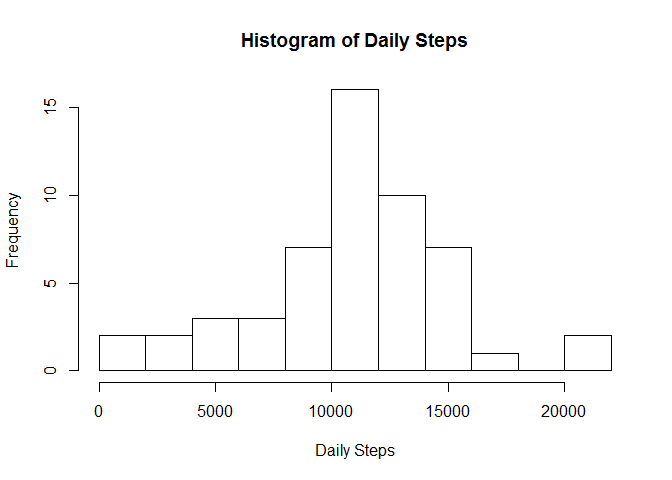
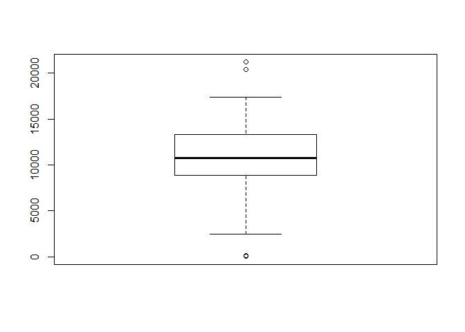
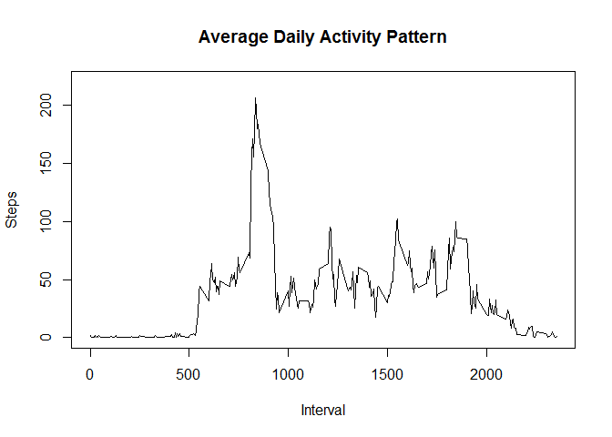
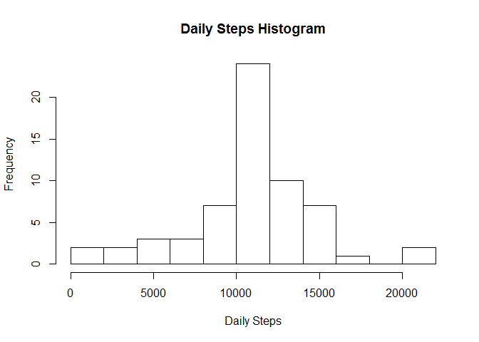
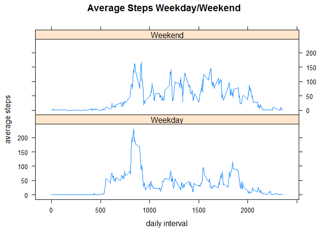

# Reproducible Research: Assignment 1
Bel Abarrientos  
Saturday, February 11, 2015  
#
It is now possible to collect a large amount of data about personal movement using activity monitoring devices such as a Fitbit, Nike Fuelband, or Jawbone Up. These type of devices are part of the "quantified self" movement - a group of enthusiasts who take measurements about themselves regularly to improve their health, to find patterns in their behavior, or because they are tech geeks. But these data remain under-utilized both because the raw data are hard to obtain and there is a lack of statistical methods and software for processing and interpreting the data.

This exercise makes use of data from a personal activity monitoring device. This device collects data at 5 minute intervals through out the day. The data consists of two months of data from an anonymous individual collected during the months of October and November, 2012 and include the number of steps taken in 5 minute intervals each day.

## Loading and preprocessing the data

Data is unzipped, read, and rows with steps NA (not available) are removed


```r
unzip("repdata-data-activity.zip")
acd1 <- read.csv("activity.csv")
acd2 <- na.omit(acd1)
```


## What is mean of total number of steps taken per day?

Histogram of total number of steps taken each day


```r
library(plyr)
```

```
## Warning: package 'plyr' was built under R version 3.1.2
```

```r
acd3 <- ddply(acd2, c("date"), summarise, tsteps = sum(steps))
hist(acd3$tsteps, breaks=15, xlab="Daily Steps", main="Histogram of Daily Steps")
```

 

Mean and Median number of steps taken each day

```r
boxplot(acd3$tsteps)
```

 

```r
summary(acd3)
```

```
##          date        tsteps     
##  2012-10-02: 1   Min.   :   41  
##  2012-10-03: 1   1st Qu.: 8841  
##  2012-10-04: 1   Median :10765  
##  2012-10-05: 1   Mean   :10766  
##  2012-10-06: 1   3rd Qu.:13294  
##  2012-10-07: 1   Max.   :21194  
##  (Other)   :47
```

```r
median(acd3$tsteps)
```

```
## [1] 10765
```

```r
mean(acd3$tsteps)
```

```
## [1] 10766
```

Mean is almost the same as the Median!

## What is the average daily activity pattern?

Time series plot (type = "l") of the 5-minute interval (x-axis) and 
the average number of steps taken, averaged across all days (y-axis)


```r
library(ggplot2)
```

```
## Warning: package 'ggplot2' was built under R version 3.1.2
```

```r
acd4 <- ddply(acd2, c("interval"), summarise, msteps = mean(steps))

par(pch=".")
plot(acd4$interval, acd4$msteps, xlab="Interval", main="Average Daily Activity Pattern",
     ylab="Steps", ylim = range(0,220),  type="l")
```

 


Which 5-minute interval, on average across all the days in the dataset, contains the maximum number of steps?


```r
maxstepsinterval <- acd4[which.max(acd4$msteps),1]
print(paste0("Interval of Max Steps: ", maxstepsinterval), type="html")
```

```
## [1] "Interval of Max Steps: 835"
```

## Imputing missing values
Now, we impute rows with missing data by replacing the NA value with average steps for the interval (calculated earlier)

Get rows with Missing values


```r
acd5 <- subset(acd1, is.na(acd1$steps))
row.names(acd5) <- NULL
narowscnt <- nrow(acd5)
print(paste0("NA Rows: ", narowscnt), type="html")
```

```
## [1] "NA Rows: 2304"
```


Replace missing values with mean of corresponding interval

Create a new dataset that is equal to the original dataset but with the missing data filled in


```r
acd5 <- acd1
imax <- nrow(acd5)
jmax <- nrow(acd4)
for (i in 1:imax) {
    if (is.na(acd5$steps[i])) { 
        for (j in 1:jmax) {
            if (acd4$interval[j] == acd1$interval[i]) {
                acd5$steps[i] <- (acd4$msteps[j])
                j <- jmax
            }
        }
    }
}
```

Summarise Total steps for each day


```r
acd6 <- ddply(acd5, c("date"), summarise, dsteps = sum(steps))
```


Histogram of Average Activity by Day Intervals
Determine Mean and Median


```r
hist(acd6$dsteps, breaks=15, xlab="Daily Steps", main="Daily Steps Histogram")
```

 

```r
summary(acd6)
```

```
##          date        dsteps     
##  2012-10-01: 1   Min.   :   41  
##  2012-10-02: 1   1st Qu.: 9819  
##  2012-10-03: 1   Median :10766  
##  2012-10-04: 1   Mean   :10766  
##  2012-10-05: 1   3rd Qu.:12811  
##  2012-10-06: 1   Max.   :21194  
##  (Other)   :55
```

Median and Mean are the same after imputting missing values!


## Are there differences in activity patterns between weekdays and weekends?

Create weekday/weekend factor
Determine which is weekday and weekend


```r
library(lubridate)
```

```
## Warning: package 'lubridate' was built under R version 3.1.2
```

```
## 
## Attaching package: 'lubridate'
## 
## The following object is masked from 'package:plyr':
## 
##     here
```

```r
acd7 <- acd5
acd7$weekfactor <- ifelse(wday(acd7$date) %in% c(7,1), "Weekend", "Weekday")
acd8 <- ddply(acd7, c("interval", "weekfactor"), summarise, msteps = mean(steps))
acd8$weekfactor <- as.factor(acd8$weekfactor)
```

Plot Weekday and Weekend activities trend (comparing weekday and weekend pattern)


```r
library(lattice)
attach(acd8)
xyplot(msteps~interval|weekfactor, main="Average Steps Weekday/Weekend", ylab="average steps", xlab="daily interval", type="l", layout=c(1,2), scales=list(x=list(tick.number=5)))
```

 
